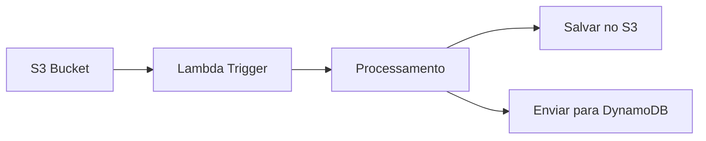

# Casos de Uso Avançados

## 1. Documentação Automatizada de Código-Fonte
**Objetivo**: Gerar documentação técnica para um projeto Python complexo  
**Passos**:
1. Crie um arquivo `config_code.yaml`:
```yaml
extractors:
  text:
    enabled: true
  py:
    enabled: true

chunking:
  strategy: semantic
  max_tokens: 1024
  min_lines: 10

output:
  directory: docs_code
```

2. Execute o pipeline:
```bash
python src/main.py --input src/ --config config_code.yaml
```

3. Saída gerada:
- Documentação estruturada por módulo
- Chunks semânticos preservando contexto
- Resumos automáticos de funcionalidades

## 2. Processamento de Documentos Jurídicos
**Objetivo**: Extrair cláusulas importantes de contratos  
**Configuração Especial**:
```yaml
# config_legal.yaml
chunking:
  strategy: fixed
  size: 200  # Pequenos chunks para precisão
  overlap: 0.0

summarization:
  enabled: true
  model: facebook/bart-large
  max_length: 50

output:
  include_metadata: false
```

**Fluxo**:
```python
from src.core.pipeline import DocumentPipeline

pipeline = DocumentPipeline('config_legal.yaml')
results = pipeline.process_directory("contratos/")

# Análise adicional
for chunk in results:
    if "confidencial" in chunk['content']:
        print(f"Cláusula confidencial encontrada: {chunk['summary']}")
```

## 3. OCR em Lote para Digitalização de Arquivos
**Objetivo**: Processar 1000 imagens de documentos escaneados  
**Solução**:
```python
# batch_ocr.py
from src.extractors.image_extractor import ImageExtractor
from src.utils.caching import FileCache
import concurrent.futures
import os

extractor = ImageExtractor()
cache = FileCache('ocr_cache.db')

def process_image(file_path):
    if cache.is_cached(file_path):
        return cache.get(file_path)
    text = extractor.extract(file_path)
    cache.set(file_path, text)
    return text

with concurrent.futures.ThreadPoolExecutor() as executor:
    image_files = [f for f in os.listdir('scanned/') if f.endswith(('.png','.jpg'))]
    results = list(executor.map(process_image, image_files))

# Salvar resultados
with open('ocr_output.txt', 'w') as f:
    for text in results:
        f.write(text + "\n\n")
```

## 4. Integração com Sistema de Tickets
**Objetivo**: Processar anexos de tickets automaticamente  
**Fluxo**:
1. Monitorar diretório de novos tickets
2. Processar anexos com pipeline
3. Enviar resumo para API de tickets

```python
# ticket_integration.py
import time
from watchdog.observers import Observer
from watchdog.events import FileSystemEventHandler
from src.core.pipeline import DocumentPipeline

pipeline = DocumentPipeline('config_tickets.yaml')

class TicketHandler(FileSystemEventHandler):
    def on_created(self, event):
        if not event.is_directory:
            result = pipeline.process_file(event.src_path)
            send_to_ticket_system(result['summary'])

def send_to_ticket_system(summary):
    # Implementação da API
    pass

observer = Observer()
observer.schedule(TicketHandler(), path='tickets/')
observer.start()

try:
    while True:
        time.sleep(1)
except KeyboardInterrupt:
    observer.stop()
observer.join()
```

## 5. Análise de Sentimento em Feedback de Clientes
**Objetivo**: Analisar sentimentos em avaliações de produtos  
**Pipeline Estendido**:
```python
# sentiment_analysis.py
from transformers import pipeline
from src.core.pipeline import DocumentPipeline

class SentimentPipeline(DocumentPipeline):
    def __init__(self, config):
        super().__init__(config)
        self.sentiment_analyzer = pipeline("sentiment-analysis")

    def process_chunk(self, chunk):
        result = super().process_chunk(chunk)
        sentiment = self.sentiment_analyzer(result['content'])[0]
        return {**result, 'sentiment': sentiment}

# Uso
config = {
    'extractors': {'text': True},
    'chunking': {'max_tokens': 512}
}
pipeline = SentimentPipeline(config)
results = pipeline.process_file("feedback.txt")

# Agregar resultados
positive = sum(1 for r in results if r['sentiment']['label'] == 'POSITIVE')
print(f"Feedback positivo: {positive/len(results)*100:.2f}%")
```

## 6. Processamento de Documentos em Nuvem
**Arquitetura**:


**Implementação AWS Lambda**:
```python
# lambda_function.py
import boto3
from src.core.pipeline import DocumentPipeline

s3 = boto3.client('s3')
pipeline = DocumentPipeline('config_cloud.yaml')

def lambda_handler(event, context):
    for record in event['Records']:
        bucket = record['s3']['bucket']['name']
        key = record['s3']['object']['key']
        
        # Download file
        file_path = f"/tmp/{key}"
        s3.download_file(bucket, key, file_path)
        
        # Process document
        result = pipeline.process_file(file_path)
        
        # Save to output bucket
        output_key = f"processed/{key}.md"
        s3.put_object(Bucket="output-bucket", Key=output_key, Body=result['content'])
```

## 7. Customização de Extrator para Formato Proprietário
**Implementação**:
```python
# custom_extractor.py
from src.extractors.base_extractor import BaseExtractor
import proprietary_lib

class CustomExtractor(BaseExtractor):
    def extract(self, file_path: str) -> str:
        if not file_path.endswith('.xyz'):
            raise ValueError("Formato não suportado")
        
        # Lógica de extração específica
        data = proprietary_lib.parse(file_path)
        return data['text_content']

# Registrar no pipeline
from src.core.pipeline import DocumentPipeline
pipeline = DocumentPipeline(config)
pipeline.register_extractor('.xyz', CustomExtractor())