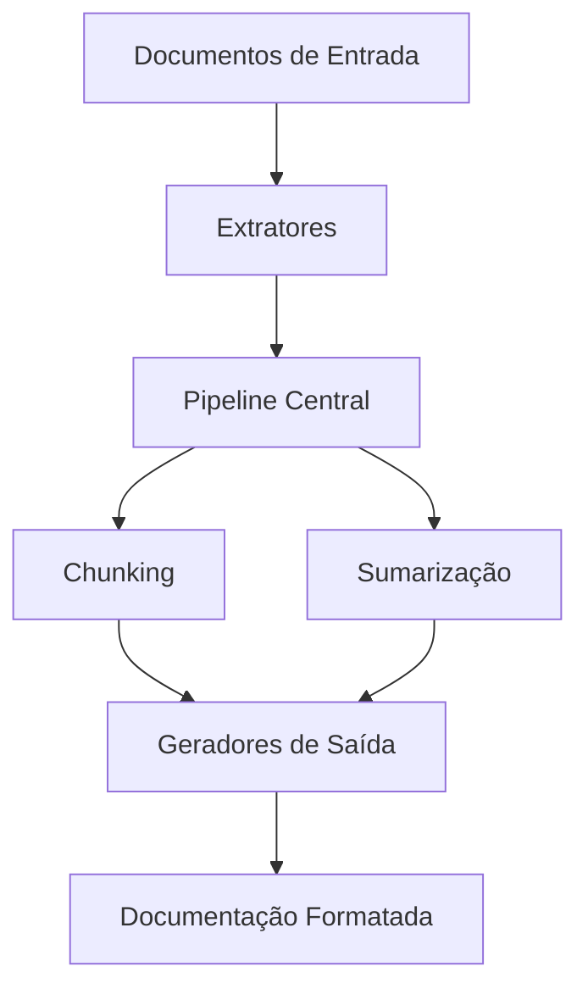

# Referência Técnica do Framework

## Visão Geral da Arquitetura


## Módulos Principais

### 1. Módulo de Extração (`src/extractors/`)
#### `BaseExtractor` (Classe Abstrata)
```python
class BaseExtractor(ABC):
    @abstractmethod
    def extract(self, file_path: str) -> str:
        """Extrai texto de um arquivo"""
```

#### Extratores Implementados:
- **`PDFExtractor`**: Extrai texto de PDFs usando pdfminer
- **`DocxExtractor`**: Extrai texto de documentos DOCX
- **`TextExtractor`**: Lê arquivos de texto simples
- **`ImageExtractor`**: Usa OCR para extrair texto de imagens

### 2. Módulo de Processamento Central (`src/core/`)
#### `Pipeline` (Classe Principal)
```python
class DocumentPipeline:
    def __init__(self, config: dict):
        self.config = config
        self.extractors = self._init_extractors()
        self.chunker = SemanticChunker(config['chunking'])
        self.summarizer = Summarizer(config['summarization'])

    def process_file(self, file_path: str):
        # Implementação do fluxo completo
```

#### `SemanticChunker`
- Divide texto mantendo unidades semânticas
- Parâmetros configuráveis: `max_tokens`, `overlap`, `min_lines`

#### `Summarizer`
- Gera resumos usando modelos transformers
- Suporta múltiplos modelos (Hugging Face)

### 3. Módulo de Saída (`src/output/`)
#### `MarkdownWriter`
```python
class MarkdownWriter:
    def write(self, chunks: list, output_path: str):
        """Escreve chunks em arquivos Markdown formatados"""
```

### 4. Módulo de Utilitários (`src/utils/`)
#### `Caching`
- Cache de processamento para evitar trabalho redundante
- Usa hashing de arquivos para detecção de mudanças

#### `ConfigLoader`
```python
def load_config(config_path: str) -> dict:
    """Carrega configurações de arquivo YAML"""
```

#### `Logger`
- Sistema de logging unificado com diferentes níveis

## Configuração Completa (`config.yaml`)
| Seção | Parâmetro | Tipo | Descrição |
|-------|-----------|------|-----------|
| **extractors** | enabled | bool | Ativa/desativa extrator |
|  | ocr_fallback | bool | Usa OCR quando extração principal falha |
| **chunking** | strategy | string | 'semantic' ou 'fixed' |
|  | max_tokens | int | Tamanho máximo de tokens por chunk |
|  | overlap | float | Sobreposição entre chunks (0.0-1.0) |
| **summarization** | enabled | bool | Ativa sumarização |
|  | model | string | Modelo Hugging Face |
|  | max_length | int | Comprimento máximo do resumo |
| **output** | format | string | 'markdown' ou 'json' |
|  | directory | string | Pasta de saída |

## Fluxo de Dados
1. **Entrada**: Arquivo é passado para o extrator apropriado
2. **Processamento**:
   - Texto é dividido em chunks
   - Cada chunk é sumarizado (se habilitado)
3. **Saída**:
   - Metadados são adicionados
   - Conteúdo é formatado
   - Arquivo final é salvo

## Dependências Externas
| Módulo | Dependências |
|--------|--------------|
| PDF | pdfminer.six |
| DOCX | python-docx |
| Imagens | pytesseract, pillow |
| Sumarização | transformers, torch |

## Diagrama de Sequência
```mermaid
sequenceDiagram
    participant Usuário
    participant Main
    participant Pipeline
    participant Extrator
    participant Chunker
    participant Summarizer
    participant Output
    
    Usuário->>Main: Executa script
    Main->>Pipeline: process_directory()
    Pipeline->>Extrator: extract()
    Extrator-->>Pipeline: Texto
    Pipeline->>Chunker: chunk_text()
    Chunker-->>Pipeline: Chunks
    Pipeline->>Summarizer: summarize()
    Summarizer-->>Pipeline: Resumos
    Pipeline->>Output: write()
    Output-->>Pipeline: Confirmação
    Pipeline-->>Main: Relatório
    Main-->>Usuário: Conclusão